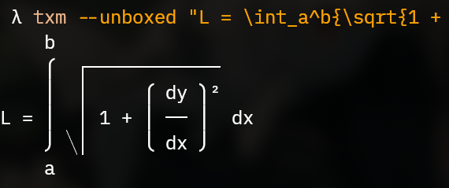

# TXM
TXM (Terminal TeX Math) is a math rendering engine with LaTeX support.

## Quick run

```
nix run github:thatmagicalcat/txm -- "E = mc^2"
```

Requires [Nix](https://nix.dev/install-nix) with flakes enabled.

# Screenshots:





# Installation
```
$ cargo install txm
```
Or
```
$ cargo install --git https://github.com/thatmagicalcat/txm
```

## License
- Apache License, Version 2.0 ([LICENSE-APACHE](LICENSE-APACHE))
- MIT license ([LICENSE-MIT](LICENSE-MIT))
